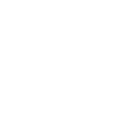
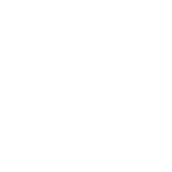
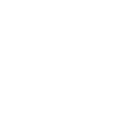
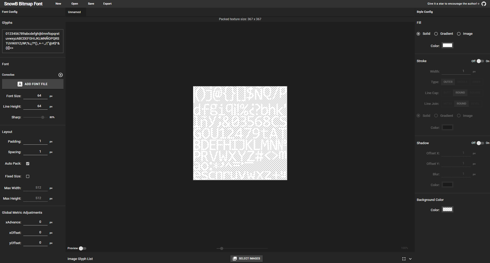

# Fonts

- BTTF (Back to the Future)
  - 
- MATRIX
  - 
- WhiteRabbit
  - 

## Creating Fonts

To create a custom font, we need to add them to the resources folder. The fonts
are Bitmap type, and for each font we want to add, it is necessary to generate
the different pixel sizes accepted by DOF2DMD, which are:

6, 8, 12, 16, 24, 32, 48, 64

Therefore, if, for example, we want to add a font called "MyFont," we would need
to generate a pair of files for each size - the .fnt and the .png - which
correspond to the bitmap font format.

```ascii
MyFont_6.fnt
MyFont_6.png

MyFont_8.fnt
MyFont_8.png

MyFont_12.fnt
MyFont_12.png

MyFont_16.fnt
MyFont_16.png

MyFont_24.fnt
MyFont_24.png

MyFont_32.fnt
MyFont_32.png

MyFont_48.fnt
MyFont_48.png

MyFont_64.fnt
MyFont_64.png
```

We can generate these fonts from a ttf or odt font using the [Snowb](https://snowb.org/) website

The steps to follow on this website would be:



1. Upload the font using the "ADD FONT FILE" button.
2. Modify the characters supported by the font in the "Glyphs" field.
3. Select the font size in "Font Size."
4. In the "Style config" section on the right, set the font color to white.
5. Click Export, specify the font name and the font file name in the format FontName_Size and Unnamed.fnt (BMFont TEXT as Export Type).
6. Extract the downloaded .zip file into the resources folder.
