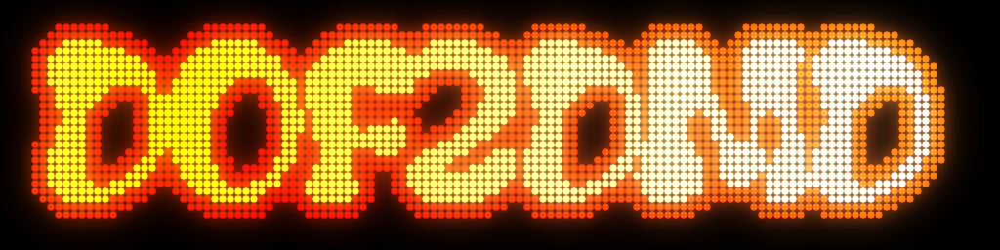

# DOF2DMD



DOF2DMD es una pequeña utilidad para cabinets arcade que muestra marquesinas de juegos, puntuaciones y animaciones en un dispositivo DMD real o emulado..


Cubre los siguientes casos de uso:

- Inicio del juego: muestra la marquesina del juego.
- Puntuación: muestra la puntuación para 1 a 4 jugadores con diferentes disposiciones según el número de jugadores.
- Eventos: muestra imágenes, videos o animaciones en formato GIF basadas en eventos del juego (por ejemplo, derribar un avión en 1942 activará una explosión).
- Texto: muestra texto con diferentes fuentes, tamaños y animaciones basadas en eventos.

DOF2DMD ofrece una sencilla API HTTP (ver [API](#api)) para mostrar imágenes, animaciones y puntuaciones.

Un caso de uso importante es la interfaz con [DOFLinx](https://www.vpforums.org/index.php?showforum=104) y su [versión modificada de MAME](https://drive.google.com/drive/folders/1AjJ8EQo3AkmG2mw7w0fLzF9HcOjFoUZH) de [DDH69](https://www.vpforums.org/index.php?showuser=95623) para que el DMD muestre animaciones mientras se juega a MAME.

Así es como se ve con un DMD emulado (usando las extensiones Freezy DMD):


DOF2DMD se basa en [FlexDMD](https://github.com/vbousquet/flexdmd), que a su vez utiliza las [extensiones Freezy DMD](https://github.com/freezy/dmd-extensions).


## Configuración

- Descarga e instala .NET 8 "Runtime desktop" desde Microsoft: [https://dotnet.microsoft.com/en-us/download/dotnet/thank-you/runtime-desktop-8.0.6-windows-x64-installer](https://dotnet.microsoft.com/en-us/download/dotnet/thank-you/runtime-desktop-8.0.6-windows-x64-installer)
- Descarga DOF2DMD desde la [sección de releases](https://github.com/DMDTools/DOF2DMD/releases), crea una carpeta y extrae el contenido del archivo en esta carpeta.
- Ajusta `settings.ini` si es necesario:

    ```ini
    ; Configuración para DOF2DMD
    ; La URL base a la que DOF2DMD escuchará. Por defecto es http://127.0.0.1:8080
    ; NO COMENTAR, ya que DOFLinx lee settings.ini para determinar a dónde enviar las solicitudes.
    url_prefix=http://127.0.0.1:8080
    ; Mostrar la puntuación durante x segundos, luego volver a la marquesina. Por defecto, 5 segundos.
    ;display_score_duration_s=5
    ; Salida detallada en el archivo debug.log si debug=true. Por defecto, false.
    ;debug=false
    ; Ruta de las imágenes (relativa a DOF2DMD o absoluta). Por defecto es "artwork".
    ;artwork_path=artwork
    ; Ancho en píxeles para el DMD. Por defecto, 128
    ;dmd_width=128
    ; Altura en píxeles para el DMD. Por defecto, 32
    ;dmd_height=32
    ; Imagen a mostrar cuando DOF2DMD se inicia. Por defecto, DOF2DMD (es decir, artwork/DOF2DMD.png o DOF2DMD.gif)
    ;start_picture=DOF2DMD
    ; Activar la visualización automática del marcador o marquesina después de usar una llamada.
    ;score_dmd=1
    ;marquee_dmd=1
    ; No implementado ---
    ;scene_default=marquee
    ;number_of_dmd=1
    ;animation_dmd=1
    ```

- Inicia DOF2DMD.
- Deberías ver el logo de DOF2DMD, ya sea en un DMD virtual o en un DMD real si has configurado `DmdDevice.ini`.
- Si utilizas DOFLinx para MAME:
  - Instala [DOFLinx](https://www.vpforums.org/index.php?showforum=104) - consulta [Configuración de DOFLinx para DOF2DMD](#use-in-doflinx).
  - Obtén la [versión modificada de MAME](https://drive.google.com/drive/folders/1AjJ8EQo3AkmG2mw7w0fLzF9HcOjFoUZH).
  - Inicia DOFLinx (debería ejecutarse al iniciar si estás en un cabinet arcade).
  - Inicia tu juego de MAME. La versión modificada de MAME se comunicará con DOFLinx, que a su vez activará llamadas a la API de DOF2DMD.
- ¡Disfruta!

## Imágenes y Animaciones

Las imágenes y animaciones deben estar en la carpeta `artwork` (por defecto en la ruta de DOF2DMD, dentro de la carpeta `artwork`).

> [!NOTA]
> Se proporciona un conjunto básico de imágenes, para que puedas probar y comenzar a editar los archivos `.MAME` de DOFLinx. Probablemente necesitarás más imágenes. No preguntes dónde encontrar imágenes para el DMD. No podemos ayudarte con eso. Sin embargo, hay un paquete que puedes descargar, y más que puedes comprar en [Neo-Arcadia](https://www.neo-arcadia.com/forum/viewtopic.php?t=67065). Si posees un [PixelCade](https://pixelcade.org/), entonces tienes derecho a una enorme biblioteca de imágenes DMD de píxeles perfectos. Para crear tus propias imágenes, puedes usar una herramienta de Pixel Art o un editor de GIFs, como [aseprite](https://www.aseprite.org/). Hay archivos de ejemplo de aseprite en [la carpeta `ingame.src`](/DOF2DMD/artwork/ingame.src/).

## API

DOF2DMD es un servidor que escucha solicitudes HTTP simples. Una vez iniciado, puedes usar las siguientes:

- `[url_prefix]/v1/display/picture?path=<ruta a imagen o video>&animation=<fade|ScrollRight|ScrollLeft|ScrollUp|ScrollDown|None>&duration=<segundos>`  
  Muestra una imagen, animación gif o video.
  - **path**: La ruta al fichero de la imagen o video a ser mostrada (sin extensión)
  - **duration**: Si la duración es 0 en una animación/video, se limitará a la duración del video o animación. Si la duración es -1, se mantendrá permanente
  - **animation**: La animación a aplicar a la escena fade|ScrollRight|ScrollLeft|ScrollUp|ScrollDown|None
- `[url_prefix]/v1/display/score?player=<jugador activor>&score=<puntuación>&cleanbg=<true|false>`  
  Muestra una pantalla de puntuación usando una disposición de hasta 4 jugadores
  - **players**: El número de jugadores para la disposición de la pantalla de puntuación. Opcional, por defecto 1
  - **player**: El jugador resaltado
  - **score**: El valor de la puntuación para el jugador resaltado
  - **credits**: Créditos insertados en el juego. Opcional
  - **cleanbg**: Borra la pantalla activa (si no se borra, la pantalla de puntuación será mostrada sobre la imagen o animación actual)
- `[url_prefix]/v1/display/scorebackground?path=<ruta imagen o video>`  
  Añade una imagen, animación gif o video como fondo en la pantalla de puntuación. 
  - **path**: La ruta al archivo de la imagen o video a ser mostrada a la pantalla de puntuación (sin extensión)
- `[url_prefix]/v1/blank`
  Limpia la pantalla
- `[url_prefix]/v1/exit`
  Sale y cierra la aplicación de DOF2DMD
- `[url_prefix]/v1/version`
  Muestra la versión de la aplicación de DOF2DMD
- `[url_prefix]/v1/display/text?text=<texto>?size=XS|S|M|L|XL&color=<hex color>&font=<font>&bordercolor=<hex color>&bordersize=<0|1>&cleanbg=<true|false>&animation=<ScrollRight|ScrollLeft|ScrollUp|ScrollDown|None>&duration=<segundos>`  
  Muestra texto con o sin animación
  - **text**: El texto a ser mostrado (el texto se puede separar en multiples lineas usando | como separador)
  - **size**: Tamaño del texto(Extra Pequeño (XS), Pequeño(S), Medio (M), Grande (L) o Extra Grande (XL))
  - **color**: El color del texto en formato hexadecimal (por ejemplo: color=FFFFFF)
  - **font**: La familia de la fuente a ser usada para el texto (En formato Bitmap Font file, hay algunos ejemplos en la carpeta resources, solo es necesario usar el nombre de la fuente antes del simbolo de subrayado _. Por ejemplo: Matrix o BTTF)
  - **bordercolor**: El color del borde del texto en formato hexadecimal (por ejemplo: color=FFFF00)
  - **bordersize**: El tamaño del borde del texto(0 o 1)
  - **cleanbg**: Borra la pantalla activa. (cuando no se borra el textpo se mostrará sobre la imagen/animación actual
  - **animation**: Animación para el texto. ScrollRight|ScrollLeft|ScrollUp|ScrollDown|None
  - **duration**: tiempo en segundos para mostrar el texto en el DMD. Si el tiempo es -1 y la animación "none", se mostrará el texto permanentemente, usando -1 en otra animación presentará una pantalla negra)
- `[url_prefix]/v1/display/advanced?path=<ruta de la imagen o video>&text=<text>?size=XS|S|M|L|XL&color=<hex color>&font=<font>&bordercolor=<hex color>&bordersize=<0|1>&cleanbg=<true|false>&animationin=<FadeIn|FadeOut|ScrollOffRight|ScrollOffLeft|ScrollOnLeft|ScrollOnRight|ScrollOffUp|ScrollOffDown|ScrollOnUp|ScrollOnDown|FillFadeIn|FillFadeOut|None>&animationout=<FadeIn|FadeOut|ScrollOffRight|ScrollOffLeft|ScrollOnLeft|ScrollOnRight|ScrollOffUp|ScrollOffDown|ScrollOnUp|ScrollOnDown|FillFadeIn|FillFadeOut|None>&duration=<segundos>`  
  Pantalla avanzada con animaciones. Puede usarse texto con o sin imagen/video/gif animado de fondo o imagen/video/gif animado
  - **text**: El texto a ser mostrado (el texto se puede separar en multiples lineas usando | como separador)
  - **path**: La ruta al archivo de la imagen o video a ser mostrado (sin extensión)
  - **size**: Tamaño del texto(Extra Pequeño (XS), Pequeño(S), Medio (M), Grande (L) o Extra Grande (XL))
  - **color**: El color del texto en formato hexadecimal (por ejemplo: color=FFFFFF)
  - **font**: La familia de la fuente a ser usada para el texto (En formato Bitmap Font file, hay algunos ejemplos en la carpeta resources, solo es necesario usar el nombre de la fuente antes del simbolo de subrayado _. Por ejemplo: Matrix o BTTF)
  - **bordercolor**: El color del borde del texto en formato hexadecimal (por ejemplo: color=FFFF00)
  - **bordersize**: El tamaño del borde del texto(0 o 1)
  - **cleanbg**: Borra la pantalla activa. (cuando no se borra el textpo se mostrará sobre la imagen/animación actual
  - **animationin**: Animación de entrada: `FadeIn|FadeOut|ScrollOffRight|ScrollOffLeft|ScrollOnLeft|ScrollOnRight|ScrollOffUp|ScrollOffDown|ScrollOnUp|ScrollOnDown|FillFadeIn|FillFadeOut|None`
  - **animationout**: Animación de salida: `FadeIn|FadeOut|ScrollOffRight|ScrollOffLeft|ScrollOnLeft|ScrollOnRight|ScrollOffUp|ScrollOffDown|ScrollOnUp|ScrollOnDown|FillFadeIn|FillFadeOut|None`
  - **duration**: tiempo en segundos para mostrar el texto e imagen en el DMD. Si el tiempo es -1 y la animación "none", se mostrará el texto permanentemente, usando -1 en otra animación presentará una pantalla negra)

## Uso en DOFLinx

Para generar efectos, DOFLinx utiliza archivos `.MAME` ubicados en la carpeta de MAME de DOFLinx. DOFLinx puede comunicarse con DOF2DMD utilizando el comando `FF_DMD` de DOFLinx. El comando `FF_DMD` puede llamar a cualquiera de las API de DOF2DMD.

### Archivo `DOFLinx.ini`

Aquí tienes un archivo `DOFLinx.ini` mínimo que funcionará con `DOF2DMD`:

```ini
# ubicación de tus archivos y sistemas
COLOUR_FILE=<ruta de DOFLinx>\config\colours.ini
DIRECTOUTPUTGLOBAL=<ruta de DOFLinx>\config\GlobalConfig_b2sserver.xml
PATH_MAME=<ruta de DOFLinx>\MAME\
MAME_FOLDER=<ruta del ejecutable de MAME (nota: debe ser la versión modificada de MAME de DOFLinx)>

# Cuándo activar, y más específicamente, cuál es el proceso de MAME para iniciar las cosas
PROCESSES=Mame64
MAME_PROCESS=Mame64

# DOF2DMD
PATH_DOF2DMD=<ubicación del ejecutable de DOF2DMD y settings.ini>
```

Nota:

- `PATH_DOF2DMD`: la ubicación del ejecutable de DOF2DMD y `settings.ini`
- `MAME_FOLDER`: ruta del ejecutable de MAME que debe ser la [versión modificada de MAME de DOFLinx](https://drive.google.com/drive/folders/1AjJ8EQo3AkmG2mw7w0fLzF9HcOjFoUZH)

### Comandos Integrados

DOFLinx generará automáticamente los siguientes comandos:

- Al iniciar DOFLinx:
  - `http://<host:port>/v1/version` - para verificar que DOF2DMD esté activo. DOFLinx intentará iniciarlo en caso contrario.
  - `http://<host:port>/v1/display/picture?path=mame/DOFLinx` - para mostrar la imagen de bienvenida de DOFLinx
- Al iniciar un juego:
  - `http://<host:port>/v1/display/picture?path=mame/<nombre-rom>&duration=<duración>&animation=<animación>` - para mostrar un PNG para la marquesina
- Al jugar un juego:
  - `http://<host:port>/v1/display/score?player=<jugador activo>&score=<puntuación>&cleanbg=<true|false>` - para mostrar la puntuación del jugador dado
  - `http://<host:port>/v1/display/score?players=<número de jugadores>&player=<jugador activo>&score=<puntuación>&cleanbg=<true|false>&credits=<créditos>` - para mostrar la puntuación del jugador dado indicando el diseño del marcador en función del número de jugadores
- Al cerrar DOFLinx:
  - `http://<host:port>/v1/display/score?player=1&score=0` - restablecer la puntuación a 0
  - `http://<host:port>/v1/blank` - para borrar el DMD (se pone en negro)
  - `http://<host:port>/v1/exit` - para indicar a DOF2DMD a salir limpiamente

### Sintaxis del comando `FF_DMD` de DOFLinx

Para agregar efectos como mostrar animaciones o texto durante el juego, debes insertar el comando `FF_DMD` en el archivo `<rom>.MAME` que corresponde al juego.

```ascii
FF_DMD,U,<LLAMADA A LA API DE DOF2DMD sin host ni prefijo /v1/>
```

- `FF_DMD` es el comando
- `U` es para un comando de usuario (específico de DOFLinx)
- Luego, la URI para llamar a DOF2DMD sin host ni prefijo /v1/


Ejemplos:

- Mostrar la animación de bonificación en el juego `artwork/ingame/bonus.gif`: `FF_DMD,U,display/picture?path=ingame/bonus&duration=0&animation=none`
- Mostrar una imagen estática `artwork/mame/pacman.png`: `FF_DMD,U,display/picture?path=mame/pacman&duration=-1`
- Mostrar un Gif animado si existe, o si no, caer en png: `artwork/mame/pacman.gif`: `FF_DMD,U,display/picture?path=mame/pacman&duration=-1`

Consulta los archivos `.MAME` incluidos en DOFLinx, que ya contienen comandos `FF_DMD`.

## Pruebas

Una vez que DOF2DMD esté iniciado, puedes usar tu navegador para probarlo:

- Mostrar versión: [http://127.0.0.1:8080/v1/version](http://127.0.0.1:8080/v1/version)
- Mostrar una imagen en la carpeta de artwork, subcarpeta `mame`, imagen `galaga`: [http://127.0.0.1:8080/v1/display/picture?path=mame/galaga&duration=-1&animation=fade](http://127.0.0.1:8080/v1/display/picture?path=mame/galaga&duration=-1&animation=fade)
- Establecer la puntuación del jugador 1 (por defecto) a 1000 usando el diseño de 4 jugadores y limpiando la escena actual: [http://127.0.0.1:8080/v1/display/score?score=1000](http://127.0.0.1:8080/v1/display/score?score=1000)
- Establecer la puntuación del jugador 2 a 3998, créditos a 5 usando el diseño de 2 jugadores sobre la escena actual: [http://127.0.0.1:8080/v1/display/score?players=2&player=2&score=3998&cleanbg=false&credits=5](http://127.0.0.1:8080/v1/display/score?players=2&player=2&score=3998&cleanbg=false&credits=5)
- Establecer el jugador activo en el jugador 2 y la puntuación a 2000 usando el diseño de 2 jugadores limpiando la escena actual: [http://127.0.0.1:8080/v1/display/score?players=2&activeplayer=2&score=2000](http://127.0.0.1:8080/v1/display/score?players=2&activeplayer=2&score=2000)
- Mostrar texto usando tamaño M con la fuente Back To the Future, color de fuente naranja, color del borde de la fuente rojo y animación de desplazamiento a la derecha durante 10 segundos: [http://127.0.0.1:8080/v1/display/text?text=HELLO|friends&font=BTTF&size=M&color=FFA500&bordersize=1&bordercolor=FF0000&cleanbg=true&animation=scrollright&duration=10](http://127.0.0.1:8080/v1/display/text?text=HELLO|friends&font=BTTF&size=M&color=FFA500&bordersize=1&bordercolor=FF0000&cleanbg=true&animation=scrollright&duration=10)
- Mostrar texto con una imagen de fondo usando la fuente White Rabbit en blanco y borde azul usando una animación de desvanecimiento para entrar y desplazamiento a la derecha como animación de salida y esperando 10 segundos entre animaciones: [http://127.0.0.1:8080/v1/display/advanced?path=mame/DOFLinx&text=Hello%20Friends!!&font=WhiteRabbit&size=M&color=0000ff&bordersize=1&bordercolor=ffffFF&cleanbg=true&animationin=FadeIn&animationout=ScrollOffRight&duration=10](http://127.0.0.1:8080/v1/display/advanced?path=mame/DOFLinx&text=Hello%20Friends!!&font=WhiteRabbit&size=M&color=0000ff&bordersize=1&bordercolor=ffffFF&cleanbg=true&animationin=FadeIn&animationout=ScrollOffRight&duration=10)
- Borrar el DMD: [http://127.0.0.1:8080/v1/blank](http://127.0.0.1:8080/v1/blank)
- Salir de DOF2DMD: [http://127.0.0.1:8080/v1/exit](http://127.0.0.1:8080/v1/exit)

O usa los scripts de PowerShell [`demo.ps1`](/DOF2DMD/demo.ps1) y [`demo2.ps1`](/DOF2DMD/demo2.ps1).

## TODO

Esto es lo que se planea implementar:

- Llamadas a la API que aún no están implementadas
- Todo lo que falta en el `settings.ini`
- Un plugin para [LaunchBox / BigBox](http://pluginapi.launchbox-app.com/) que se interfase con DOF2DMD para mostrar sistemas y marquesinas de juegos al navegar por los juegos (implementado parcialmente)
- Un plugin para [Attract-Mode](https://attractmode.org/) que se interfase con DOF2DMD para mostrar sistemas y marquesinas de juegos al navegar por los juegos (en proceso)

## ??? Preguntas y soporte

Cuento con la comunidad de Pinball y Arcade para ayudarse mutuamente a través de las [discusiones en GitHub](https://github.com/ojacques/DOF2DMD/discussions).
También estaré allí.

## Agradecimientos

Gracias a:

- [@ojacques](https://github.com/ojacques) por crear la primera versión de este proyecto
- DDH69 por DOFLinx, MAME para DOFLinx y su apoyo en este proyecto. Piensa en [?? donar a DDH69](https://www.paypal.com/donate?hosted_button_id=YEPCTUYFX5KDE) para apoyar su trabajo.
- El equipo de [Pixelcade](https://pixelcade.org/) que nos inspiró a implementar algo para nuestro ZeDMD, incluyendo soporte para otros DMDs. Por favor, échales un vistazo, me dicen que sus DMDs son de primera calidad, con múltiples tamaños, y si tienes uno de ellos, hay una tonelada de arte disponible.
- El creador de ZeDMD - [Zedrummer](https://www.pincabpassion.net/t14798-tuto-installation-du-zedmd), que es un DMD bonito y económico. Puedes comprar ZeDMD en múltiples lugares.
- Todos en [Monte Ton Cab (FR)](https://montetoncab.fr/) - ¡qué comunidad tan acogedora!
