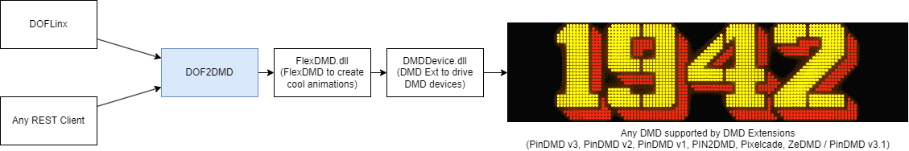

# DOF2DMD


DOF2DMD is a small utility for arcade cabinets to display game marquees, score
and animations on a real or emulated DMD device.

It covers the following use cases:

- Starting the game: showing the game marquee
- Score: showing the score for 1 up to 4 players
- Events: showing animations based on events in the game (eg shooting down a plane in 1942 will trigger an explosion)

DOF2DMD offers a simple HTTP API (see [API](#api)) to display pictures, animations and scores.

One big use case is to interface
[DOFLinx](https://www.vpforums.org/index.php?showforum=104) and its
[modified version of MAME](https://drive.google.com/drive/folders/1AjJ8EQo3AkmG2mw7w0fLzF9HcOjFoUZH)
from [DDH69](https://www.vpforums.org/index.php?showuser=95623) to get the DMD
to show animations while playing MAME.

Here is how it looks like with an emulated DMD (using Freezy DMD extensions):


DOF2DMD relies on [FlexDMD](https://github.com/vbousquet/flexdmd), which itself
uses [Freezy DMD extensions](https://github.com/freezy/dmd-extensions)



## Setup

- Download and install dotnet 8 "Runtime desktop" from Microsoft: https://dotnet.microsoft.com/en-us/download/dotnet/thank-you/runtime-desktop-8.0.6-windows-x64-installer
- Download DOF2DMD from [Release section](https://github.com/ojacques/DOF2DMD/releases), create a folder and extract the content of the archive in this folder
- Tweak `settings.ini` if needed:

    ```ini
    ; Settings for DOF2DMD
    ; The base URL that DOF2DMD will listen to. Defaults to http://127.0.0.1:8080
    ;url_prefix=http://127.0.0.1:8080
    ; Display the score for x seconds, then back to marquee. Defaults to 5 seconds.
    ;display_score_duration_s=5
    ; Verbose output in debug.log file if debug=true. Defaults to false.
    ;debug=false
    ; Path of the artwork (relative to DOF2DMD or absolute). Defaults to "artwork"
    ;artwork_path=artwork
    ; Width in pixels for DMD. Defaults to 128
    ;dmd_width=128
    ; Height in pixels for DMD. Defaults to 64
    ;dmd_height=64
    ; Picture to display when DOF2DMD starts. Defaults to DOF2DMD (that is artwork/DOF2DMD.png or DOF2DMD.gif)
    ;start_picture=
    ; Not implemented ---
    ;scene_default=marquee
    ;number_of_dmd=1
    ;animation_dmd=1
    ;score_dmd=1
    ;marquee_dmd=1
    
    ```
- Launch DOF2DMD
- You should see the DOF2DMD logo, either on a Virtual DMD, or real DMD if you have configured `DmdDevice.ini`
- If using DOFLinx for MAME
  - Install [DOFLinx](https://www.vpforums.org/index.php?showforum=104)
  - Get [modified MAME version](https://drive.google.com/drive/folders/1AjJ8EQo3AkmG2mw7w0fLzF9HcOjFoUZH)
  - Launch DOFLinx (should be at startup if you are on an Arcade cabinet).
  - Launch your MAME game. The modified version of MAME will communicate with
    DOFLinx, which in turn will trigger API calls to DOF2DMD.
- Enjoy!

## Artwork

The images and animations must be in the `artwork` folder (by default in the DOF2DMD path under the `artwork` folder).


> [!NOTE]
> Do not ask me where to find artwork for the DMD. I cannot help with
that. There is however a pack you can download, and more you can buy from
[Neo-Arcadia](https://www.neo-arcadia.com/forum/viewtopic.php?t=67065). If you
own a [PixelCade](https://pixelcade.org/), then you are entitled to a massive
pixel perfect DMD artwork library.


## API

DOF2DMD is a server listening to simple http request. Once it has started, you can use the following :

- `[url_prefix]/v1/display/picture?path=<path>?fixed=true|false`
  - Display an image or video
  - **path**: The file path of the image or video to be displayed
  - **fixed**: A boolean flag indicating whether the file must be forced to fixed (not a gif)
- `[url_prefix]/v1/display/score?player=<player>&score=<score>`
  - **player**: optional : the identifier of the player whose score is being displayed (1, 2, 3 or 4)
  - **score**: The score value to be displayed for active player
- `[url_prefix]/v1/blank`
  - This endpoint clears or blanks the display
- `[url_prefix]/v1/exit`
  - This endpoint exits or closes the application
- `[url_prefix]/v1/version`
  - This endpoint returns the version information of the application
- NOT IMPLEMENTED: `[url_prefix]/v1/display/scorebackgroundimage?path=<path>&brightness=<brightness 0-15>`
  - Displays a background image to display behind the score.
  - **path**: The file path of the background image to be displayed
  - **brightness**: The brightness level of the background image, ranging from 0 to 15
- NOT IMPLEMENTED: `[url_prefix]/v1/display/text?text=<text>?size=S|M|L&color=#FFFFFF&font=font&bordercolor=color&bordersize=size`
  - Display some text
  - **text**: The text to be displayed
  - **size**: The size of the text (Small, Medium, or Large)
  - **color**: The color of the text in hexadecimal format
  - **font**: The font family to be used for the text
  - **bordercolor**: The color of the text border in hexadecimal format
  - **bordersize**: The size of the text border
- NOT IMPLEMENTED: `[url_prefix]/v1/display/scene?background=<image or video path>&toptext=<text>&topbrightness=<brightness 0 - 15>&bottomtext=<text>&bottombrightness=<brightness 0 - 15>&animatein=<0 - 15>&animateout=<0 - 15>&pausetime=<pause in ms>`
  - Display some text with a background image or video
  - **background**: The file path of the background image or video
  - **toptext**: The text to be displayed at the top of the scene
  - **topbrightness**: The brightness level of the top text, ranging from 0 to 15
  - **bottomtext**: The text to be displayed at the bottom of the scene
  - **bottombrightness**: The brightness level of the bottom text, ranging from 0 to 15
  - **animatein**: The animation effect for the scene entrance, ranging from 0 to 15
  - **animateout**: The animation effect for the scene exit, ranging from 0 to 15
  - **pausetime**: The duration in milliseconds for which the scene should be displayed

## Testing

Once DOF2DMD is started, you can use your browser to test it:

- Show version [http://127.0.0.1:8080/v1/version](http://127.0.0.1:8080/v1/version) 
- Display picture in the artwork folder, subfolder `mame`, picture `galaga`: [http://127.0.0.1:8080/v1/display/picture?path=mame/galaga](http://127.0.0.1:8080/v1/display/picture?path=mame/galaga) 
- Set score of player 1 (default) to 1000: [http://127.0.0.1:8080/v1/display/score?score=1000](http://127.0.0.1:8080/v1/display/score?score=1000)
- Set active player to player 2 and set score to 2000: [http://127.0.0.1:8080/v1/display/score?player=2&score=2000](http://127.0.0.1:8080/v1/display/score?player=2&score=2000)
- Blank the DMD [http://127.0.0.1:8080/v1/blank](http://127.0.0.1:8080/v1/blank)
- Exit DOF2DMD [http://127.0.0.1:8080/v1/exit](http://127.0.0.1:8080/v1/exit)

## TODO

Here is what I plan to implement : 

- API calls which are not implemented yet
- Everything missing from the `settings.ini`
- A plugin for [Launch box / big box](http://pluginapi.launchbox-app.com/) which
  will interface with DOF2DMD to show systems and game marquees when browsing
  games
- Better score display

## Thank you

Thanks to

- DDH69 for DOFLinx, MAME for DOFLinx, and his support in this project. Think of
  [donating to DDH69](https://www.paypal.com/donate?hosted_button_id=YEPCTUYFX5KDE).
- [Pixelcade](https://pixelcade.org/) team who inspired me in implementing
  something for my ZeDMD, including support for other DMDs (hopefully!). Please,
  check them out, their DMDs are top notch, multiple sizes, and if you own one
  of them, there is a ton of artwork available.
- The creator of ZeDMD -
  [Zedrummer](https://www.pincabpassion.net/t14798-tuto-installation-du-zedmd),
  which is a nice and cheap DMD. You can buy ZeDMD in multiple places.
- Everyone at [Monte Ton Cab (FR)](https://montetoncab.fr/) - what a welcoming
  community!
